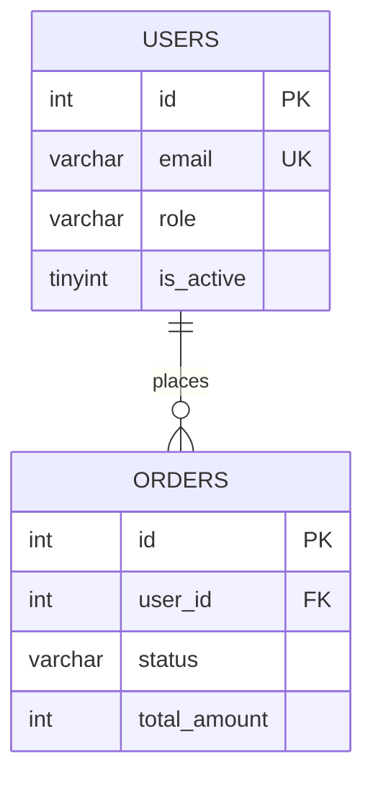

# dl-ideas-task

### ERD

```mermaid
erDiagram
    USERS ||--o{ ORDERS : places
    USERS {
        int id PK
        varchar email UK
        varchar role
        tinyint is_active
    }
    ORDERS {
        int id PK
        int user_id FK
        varchar status
        int total_amount
    }
```
